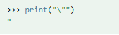
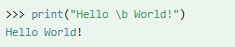

# Python 变量str

- 属于不可变数据，不允许对str的某个元素索引例如`str[2]='u'  # 非法`

## 定义

字符串是以**单引号**或**双引号**包裹起来的任意文本，比如`'hello'`和`"hello"`。

```python
str='hello'
print(str)
str="hello"
print(str)

str3 = '''hello
python'''

 
para_str = """这是一个多行字符串的实例
多行字符串可以使用制表符
TAB ( \t )。
也可以使用换行符 [ \n ]。
"""
print (para_str)
```

注意：python中的srt是不可变的如果执行下面的代码是会报错的

```
str='hello'
str[2]='u'  # 非法
```


## 字符串变量常规操作

1. 字符串索引

   Python 不支持单字符类型，单字符在 Python 中也是作为一个字符串使用。

   索引值以 **0** 为开始值，**-1** 为从末尾的开始位置

   ```
   mystring='RUNOOB'  
   #下面说明索引使用情况，请忽略中间的空格
    R	U  	N  	O  	O  	B
    0	1  	2  	3  	4  	5   #从前面索引 
   -6 -5  -4  -3  -2  -1   #从后面索引
   ```

   无论从前面索引还是后面和c语言一样，比如

   - `mystring[2]=='N'`
   - `mystring[-4]=='N'`

2. 字符串切片

   Python 访问子字符串，可以使用方括号 **[]** 来截取字符串，字符串的截取的语法格式如下：

   格式如下：

   ```
   字符串切片 str[start:end]，
   ```

   **注意**：其中 start（包含）是切片开始的索引，end（不包含）是切片结束的索引。
   
   
   
   
   
   
   
3. 字符串拼接

   ```python
   s1 = 'Hello'
   s2 = "World"
   s3 = s1 + ' ' + s2
   s4 = s1[0:2] + ' ' + s2
   print(s3)  # 输出 'Hello World'
   print(s4)  # 输出 'He World'
   ```

   

4. 字符串重复

   ```python
   s1 = 'Hello'
   print(s1 * 2)  # 输出 'HelloHello'
   ```


## 字符串相关的操作符号

下表实例变量 a = "Hello"，b ="Python"：

| 操作符 | 描述                                                         | 实例                            |
| :----- | :----------------------------------------------------------- | :------------------------------ |
| +      | 字符串连接                                                   | a + b 输出结果： HelloPython    |
| *      | 重复输出字符串                                               | a*2 输出结果：HelloHello        |
| []     | 通过索引获取字符串中字符                                     | a[1] 输出结果 **e**             |
| [ : ]  | 截取字符串中的一部分，遵循**左闭右开**原则，str[0:2] 是不包含第 3 个字符的。 | a[1:4] 输出结果 **ell**         |
| in     | 成员运算符 ： 如果字符串中包含给定的字符返回 True            | **'H' in a** 输出结果 True      |
| not in | 成员运算符 ：如果字符串中不包含给定的字符返回 True           | **'M' not in a** 输出结果 True  |
| r/R    | 原始字符串 ：所有的字符串都是直接按照字面的意思来使用，没有转义特殊或不能打印的字符。 原始字符串除在字符串的第一个引号前加上字母 **r**（可以大小写）以外，与普通字符串有着几乎完全相同的语法。 | `print( r'\n' ) print( R'\n' )` |
| %      | 格式字符串                                                   | todo                            |

```python
#!/usr/bin/python3
 
a = "Hello"
b = "Python"
 
print("a + b 输出结果：", a + b)
print("a * 2 输出结果：", a * 2)
print("a[1] 输出结果：", a[1])
print("a[1:4] 输出结果：", a[1:4])
 
if( "H" in a) :
    print("H 在变量 a 中")
else :
    print("H 不在变量 a 中")
 
if( "M" not in a) :
    print("M 不在变量 a 中")
else :
    print("M 在变量 a 中")
 
print (r'\n')
print (R'\n')
```

运行结果如下：

```
a + b 输出结果： HelloPython
a * 2 输出结果： HelloHello
a[1] 输出结果： e
a[1:4] 输出结果： ell
H 在变量 a 中
M 不在变量 a 中
\n
\n
```

## Python 转义字符

| 转义字符     | 描述                                                         | 实例                                   |
| :----------- | :----------------------------------------------------------- | :------------------------------------- |
| \ (在行尾时) | 续行符                                                       |  |
| \ \          | 反斜杠符号                                                   |  |
| \'           | 单引号                                                       |  |
| \"           | 双引号                                                       |  |
| \a           | 响铃                                                         |  |
| \b           | 退格(Backspace)                                              |  |
| \000         | 空                                                           |  |
| \n           | 换行                                                         |  |
| \v           | 纵向制表符                                                   |  |
| \t           | 横向制表符                                                   |  |
| \r           | 回车，将 **\r** 后面的内容移到字符串开头，并逐一替换开头部分的字符，直至将 **\r** 后面的内容完全替换完成。 |  |
| \f           | 换页                                                         |  |
| \yyy         | 八进制数，y 代表 0~7 的字符，例如：\012 代表换行。           |  |
| \xyy         | 十六进制数，以 \x 开头，y 代表的字符，例如：\x0a 代表换行    |  |
| \other       | 其它的字符以普通格式输出                                     |                                        |

```python
#!/usr/bin/python3
 
a = "Hello"
b = "Python"
 
print("a + b 输出结果：", a + b)
print("a * 2 输出结果：", a * 2)
print("a[1] 输出结果：", a[1])
print("a[1:4] 输出结果：", a[1:4])
 
if( "H" in a) :
    print("H 在变量 a 中")
else :
    print("H 不在变量 a 中")
 
if( "M" not in a) :
    print("M 不在变量 a 中")
else :
    print("M 在变量 a 中")
 
print (r'\n')
print (R'\n')
```

运行结果

```
a + b 输出结果： HelloPython
a * 2 输出结果： HelloHello
a[1] 输出结果： e
a[1:4] 输出结果： ell
H 在变量 a 中
M 不在变量 a 中
\n
\n
```

## Python 字符串格式化

和c语言一样

```python
#!/usr/bin/python3
 
print ("我叫 %s 今年 %d 岁!" % ('小明', 10))
#运行结果
# 我叫 小明 今年 10 岁!
```

## f-string

f-string 是 python3.6 之后版本添加的，称之为字面量格式化字符串，是新的格式化字符串的语法。

之前我们习惯用百分号 (%):

```python
>>> name = 'Runoob'
>>> 'Hello %s' % name
'Hello Runoob'
```

**f-string** 格式化字符串以 **f** 开头，后面跟着字符串，字符串中的表达式用大括号 {} 包起来，它会将变量或表达式计算后的值替换进去，实例如下：

```
>>> name = 'Runoob'
>>> f'Hello {name}'  # 替换变量
'Hello Runoob'
>>> f'{1+2}'         # 使用表达式
'3'

>>> w = {'name': 'Runoob', 'url': 'www.runoob.com'}
>>> f'{w["name"]}: {w["url"]}'
'Runoob: www.runoob.com'
```

在 Python 3.8 的版本中可以使用 **=** 符号来拼接运算表达式与结果：

```
>>> x = 1
>>> print(f'{x+1}')   # Python 3.6
2

>>> x = 1
>>> print(f'{x+1=}')   # Python 3.8
x+1=2
```


## python 字符串内建函数

- `capitalize()`：第一个字符大写，其余全小写。

  ```python
  s1 = 'helLo woRd'
  print(s1.capitalize())  # 输出 'Hello word'
  ```

- `center(width,fillchar)`：返回一个指定的宽度 width 居中的字符串，fillchar 为填充的字符，默认为空格

  ```python
  s1 = 'Hello word'
  print(s1.center(20,'*'))
  
  ```

  输出

  ```
  *****Hello word*****
  ```

- `count(str, beg= 0,end=len(string))` ：返回 str 在 string 里面出现的次数，如果 beg 或者 end 指定则返回指定范围内 str 出现的次数

  ```python
  text = "hello world, hello python"
   
  
  # 统计字符 'l' 出现的次数
  count1 = text.count('l')
  count2 = text.count('l',0,2)
  count3 = text.count('l',0,3)
  
  print(f"count1={count1} count2={count2} count3={count3}")
  ```

  输出结果

  ```
  count1=5 count2=0 count3=1
  ```

  

- `bytes.decode(encoding="utf-8", errors="strict")`

  Python3 中没有 decode 方法，但我们可以使用 bytes 对象的 decode() 方法来解码给定的 bytes 对象，这个 bytes 对象可以由 str.encode() 来编码返回。

  ```python
  str = "我是python";
  str_utf8 = str.encode("UTF-8")
  str_gbk = str.encode("GBK")
   
  print(str)
   
  print("UTF-8 编码：", str_utf8)
  print("GBK 编码：", str_gbk)
   
  print("UTF-8 解码：", str_utf8.decode('UTF-8','strict'))
  print("GBK 解码：", str_gbk.decode('GBK','strict'))
  ```

  运行结果

  ```
  我是python
  UTF-8 编码： b'\xe6\x88\x91\xe6\x98\xafpython'
  GBK 编码： b'\xce\xd2\xca\xc7python'
  UTF-8 解码： 我是python
  GBK 解码： 我是python
  ```

  

- `encode(encoding='UTF-8',errors='strict')`

  以 encoding 指定的编码格式编码字符串，如果出错默认报一个ValueError 的异常，除非 errors 指定的是'ignore'或者'replace‘

  

- `endswith(suffix, beg=0, end=len(string))`

  检查字符串是否以 suffix 结束，如果 beg 或者 end 指定则检查指定的范围内是否以 suffix 结束，如果是，返回 True,否则返回 False。

  ```python
  #!/usr/bin/python3
   
  Str='Runoob example....wow!!!'
  suffix='!!'
  print (Str.endswith(suffix))
  print (Str.endswith(suffix,20))
  suffix='run'
  print (Str.endswith(suffix))
  print (Str.endswith(suffix, 0, 19))
  ```

  运行结果

  ```
  True
  True
  False
  False
  
  ```

  

- `expandtabs(tabsize=8)`

  把字符串 string 中的 tab 符号转为空格，tab 符号默认的空格数是 8 。

  ```python
  #!/usr/bin/python3
   
   
  str = "runoob\t12345\tabc"  
  print('原始字符串:', str)
   
  # 默认 8 个空格
  # runnob 有 6 个字符，后面的 \t 填充 2 个空格
  # 12345 有 5 个字符，后面的 \t 填充 3 个空格
  print('替换 \\t 符号:', str.expandtabs())
   
  # 2 个空格
  # runnob 有 6 个字符，刚好是 2 的 3 倍，后面的 \t 填充 2 个空格
  # 12345 有 5 个字符，不是 2 的倍数，后面的 \t 填充 1 个空格
  print('使用 2 个空格替换 \\t 符号:', str.expandtabs(2))
   
  # 3 个空格
  print('使用 3 个空格:', str.expandtabs(3))
   
  # 4 个空格
  print('使用 4 个空格:', str.expandtabs(4))
   
  # 5 个空格
  print('使用 5 个空格:', str.expandtabs(5))
   
  # 6 个空格
  print('使用 6 个空格:', str.expandtabs(6))
  ```

  运行结果

  ```
  原始字符串: runoob      12345   abc
  替换 \t 符号: runoob  12345   abc
  使用 2 个空格替换 \t 符号: runoob  12345 abc
  使用 3 个空格: runoob   12345 abc
  使用 4 个空格: runoob  12345   abc
  使用 5 个空格: runoob    12345     abc
  使用 6 个空格: runoob      12345 abc
  
  ```

  

-  `find(str, beg=0, end=len(string))`

  ```
  检测 str 是否包含在字符串中，如果指定范围 beg 和 end ，则检查是否包含在指定范围内，如果包含返回开始的索引值，否则返回-1
  ```

  ```python
  #!/usr/bin/python3
   
  str1 = "Runoob example....wow!!!"
  str2 = "exam";
   
  print (str1.find(str2))     #从0位置开始找
  print (str1.find(str2, 5))  #从下标为5处开始找
  print (str1.find(str2, 10)) #从下标10处开始找 找不到
  ```

  运行结果

  ```
  7
  7
  -1
  
  ```

- `index(str, beg=0, end=len(string))`：跟find()方法一样，只不过如果str不在字符串中会报一个异常。

  ```python
  #!/usr/bin/python3
  
  str1 = "Runoob example....wow!!!"
  str2 = "exam";
  
  print (str1.index(str2))
  print (str1.index(str2, 5))
  print (str1.index(str2, 10))
  ```

  运行结果

  ```
  7
  7
  Traceback (most recent call last):
    File "test.py", line 8, in <module>
      print (str1.index(str2, 10))
  ValueError: substring not found
  
  ```

- isalnum()

  只有数字或者字母组成True, 否则返回 False

  - **空字符串**：如果字符串为空（长度为0），则返回 `False`，因为空字符串不包含任何字母或数字。
  - **大小写敏感**：`isalnum()` 方法区分大小写，即只有字母和数字的字符才会被认为是有效的。
  - **特殊字符**：特殊字符（如标点符号、空格、特殊符号等）不被认为是字母或数字。

  ```python
  # 示例 1: 包含字母和数字的字符串
  print("abc123".isalnum())  # 输出: True
  
  # 示例 2: 包含空格的字符串
  print("abc 123".isalnum())  # 输出: False
  
  # 示例 3: 包含特殊字符的字符串
  print("abc#123".isalnum())  # 输出: False
  
  # 示例 4: 空字符串
  print("".isalnum())  # 输出: False
  
  # 示例 5: 只包含数字的字符串
  print("123456".isalnum())  # 输出: True
  
  # 示例 6: 只包含字母的字符串
  print("abcdef".isalnum())  # 输出: True
  
  # 示例 7: 包含下划线但不是字母或数字的字符串
  print("abc_def".isalnum())  # 输出: False
  ```

- [isalpha()](https://www.runoob.com/python3/python3-string-isalpha.html)

  只有字母组成 True, 否则返回 False

  ```python
  # 示例 1: 只包含字母的字符串
  print("HelloWorld".isalpha())  # 输出: True
  
  # 示例 2: 包含数字的字符串
  print("Hello123".isalpha())  # 输出: False
  
  # 示例 3: 包含空格的字符串
  print("Hello World".isalpha())  # 输出: False
  
  # 示例 4: 包含特殊字符的字符串
  print("Hello#World".isalpha())  # 输出: False
  
  # 示例 5: 空字符串
  print("".isalpha())  # 输出: False
  
  # 示例 6: 包含下划线的字符串
  print("Hello_World".isalpha())  # 输出: False
  
  # 示例 7: 包含非ASCII字母的字符串
  print("HélloWorld".isalpha())  # 输出: True，因为é是字母
  ```

- [isdigit()](https://www.runoob.com/python3/python3-string-isdigit.html)

  只有数字则返回 True 否则返回 False.

  isdigit() 方法只对正整数有效，负数及小数均返回不正确。

  ```
  #!/usr/bin/python3
  
  str = "123456"; 
  print (str.isdigit())
  
  str = "Runoob example....wow!!!"
  print (str.isdigit())
   
  ```

  运行结果

  ```
  True
  False
  
  ```

- [islower()](https://www.runoob.com/python3/python3-string-islower.html)

  如果字符串中包含至少一个区分大小写的字符，并且所有这些(区分大小写的)字符都是小写，则返回 True，否则返回 False

  ```python
  #!/usr/bin/python3
  
  str = "RUNOOB example....wow!!!"
  print (str.islower())
  
  str = "runoob example....wow!!!"
  print (str.islower())
  ```

  以上实例输出结果如下：

  ```
  False
  True
  ```

- [isnumeric()](https://www.runoob.com/python3/python3-string-isnumeric.html)

  isnumeric() 方法检测字符串是否只由数字组成，数字可以是： Unicode 数字，全角数字（双字节），罗马数字，汉字数字。

  指数类似 **²** 与分数类似 **½** 也属于数字。

  ```python
  #!/usr/bin/python3
  
  #s = '²3455'
  s = '\u00B23455'
  print(s.isnumeric())
  # s = '½'
  s = '\u00BD'
  print(s.isnumeric())
  
  a = "\u0030" #unicode for 0
  print(a.isnumeric())
  
  b = "\u00B2" #unicode for ²
  print(b.isnumeric())
  
  c = "10km2"
  print(c.isnumeric())
  
  
  
  
  str = "runoob2016"  
  print (str.isnumeric())
  
  str = "23443434"
  print (str.isnumeric())
  ```

  以上实例输出结果如下：

  ```
  True
  True
  True
  True
  False
  
  False
  True
  
  ```

- [isspace()](https://www.runoob.com/python3/python3-string-isspace.html)

  如果字符串中只包含空格，则返回 True，否则返回 False.

  ```
  #!/usr/bin/python3
   
  str = "       " 
  print (str.isspace())
   
  str = "Runoob example....wow!!!"
  print (str.isspace())
  ```

  以上实例输出结果如下：

  ```
  True
  False
  ```

- 参见[Python3 字符串 | 菜鸟教程 (runoob.com)](https://www.runoob.com/python3/python3-string.html)