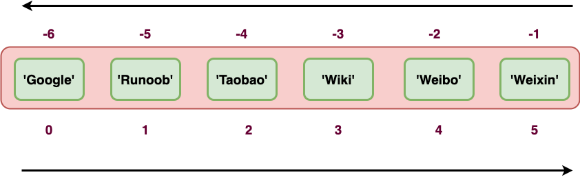

# Python变量之元组

- 元素不可修改
- 使用小括号 **( )**定义，列表使用方括号 **[ ]**
- 括号中添加元素，并使用逗号隔开即可


## tuple创建

1. 直接使用小括号

   ```python
   tup1 = ('Google', 'Runoob', 1997, 2000)
   tup2 = (1, 2, 3, 4, 5 )
   tup3 = "a", "b", "c", "d"   #  不需要括号也可以
   ```

   

2. 创建空元组

   ```
   tup1 = ()
   ```

   

3. 元组中只包含一个元素时，需要在元素后面添加逗号 **,** ，否则括号会被当作运算符使用：

   ```
   >>> tup1 = (50)
   >>> type(tup1)     # 不加逗号，类型为整型
   <class 'int'>
   
   >>> tup1 = (50,)
   >>> type(tup1)     # 加上逗号，类型为元组
   <class 'tuple'>
   ```

   

## tuple访问

元组与字符串类似，下标索引从 0 开始，可以进行截取，组合等。


```python
#!/usr/bin/python3
 
tup1 = ('Google', 'Runoob', 1997, 2000)
tup2 = (1, 2, 3, 4, 5, 6, 7 )
 
print ("tup1[0]: ", tup1[0])
print ("tup2[1:5]: ", tup2[1:5])
```

以上实例输出结果：

```
tup1[0]:  Google
tup2[1:5]:  (2, 3, 4, 5)
```

## 修改元组

元组中的元素值是不允许修改的，但我们可以对元组进行连接组合，如下实例:

```python
#!/usr/bin/python3
 
tup1 = (12, 34.56)
tup2 = ('abc', 'xyz')
 
# 以下修改元组元素操作是非法的。
# tup1[0] = 100
 
# 创建一个新的元组
tup3 = tup1 + tup2
print (tup3)
```

以上实例输出结果：

```
(12, 34.56, 'abc', 'xyz')
```

## 删除元组

元组中的元素值是不允许删除的，但我们可以使用del语句来删除整个元组，如下实例:

```python
#!/usr/bin/python3
 
tup = ('Google', 'Runoob', 1997, 2000)
 
print (tup)
del tup
print ("删除后的元组 tup : ")
print (tup)
```

以上实例元组被删除后，输出变量会有异常信息，输出如下所示：

```
删除后的元组 tup : 
Traceback (most recent call last):
  File "test.py", line 8, in <module>
    print (tup)
NameError: name 'tup' is not defined
```

## 元组运算符

与字符串一样，元组之间可以使用 **+**、**+=**和 ***** 号进行运算。这就意味着他们可以组合和复制，运算后会生成一个新的元组。

| Python 表达式                                                | 结果                         | 描述                                                         |
| :----------------------------------------------------------- | :--------------------------- | :----------------------------------------------------------- |
| `len((1, 2, 3))`                                             | 3                            | 计算元素个数                                                 |
| >>> a = (1, 2, 3) b = (4, 5, 6) <br/>>>> c = a+b<br/> >>> c (1, 2, 3, 4, 5, 6) | (1, 2, 3, 4, 5, 6)           | 连接，c 就是一个新的元组，它包含了 a 和 b 中的所有元素。     |
| >>> a = (1, 2, 3)<br/> >>> b = (4, 5, 6)<br/> >>> a += b <br/>>>> a (1, 2, 3, 4, 5, 6) | (1, 2, 3, 4, 5, 6)           | 连接，a 就变成了一个新的元组，它包含了 a 和 b 中的所有元素。 |
| `('Hi!',) * 4`                                               | ('Hi!', 'Hi!', 'Hi!', 'Hi!') | 复制                                                         |
| `3 in (1, 2, 3)`                                             | True                         | 元素是否存在                                                 |
| for x in (1, 2, 3): <br/>    print (x, end=" ")              | 1 2 3                        | 迭代                                                         |

## 元组索引，截取

因为元组也是一个序列，所以我们可以访问元组中的指定位置的元素，也可以截取索引中的一段元素，如下所示：

元组：

```python
tup = ('Google', 'Runoob', 'Taobao', 'Wiki', 'Weibo','Weixin')

```



```
>>> tup = ('Google', 'Runoob', 'Taobao', 'Wiki', 'Weibo','Weixin')
>>> tup[1]
'Runoob'
>>> tup[-2]
'Weibo'
>>> tup[1:]
('Runoob', 'Taobao', 'Wiki', 'Weibo', 'Weixin')
>>> tup[1:4]
('Runoob', 'Taobao', 'Wiki')
>>>
```

## 元组嵌套

```
t1 = ((1, 2, 3), (4, 5, 6))

```

可以包含任意类型的数据：元组的元素可以是任何类型，包括其他元组或其他容器类型如列表、字典等

## 元组内置函数

Python元组包含了以下内置函数

| 序号 | 方法及描述                                                   | 实例                                                         |
| :--- | :----------------------------------------------------------- | :----------------------------------------------------------- |
| 1    | len(tuple) 计算元组元素个数。                                | >>> tuple1 = ('Google', 'Runoob', 'Taobao')<br> >>> len(tuple1)<br/> 3 <br/>>>> |
| 2    | max(tuple) 返回元组中元素最大值。                            | >>> tuple2 = ('5', '4', '8') <br/>>>> max(tuple2) <br/>'8' <br/>>>> |
| 3    | min(tuple) 返回元组中元素最小值。                            | >>> tuple2 = ('5', '4', '8') <br/>>>> min(tuple2) <br/>'4' <br/>>>> |
| 4    | tuple(iterable) 将可迭代系列转换为元组。 例子中是将列表转换为元组 | >>> list1= ['Google', 'Taobao', 'Runoob', 'Baidu'] <br/>>>> tuple1=tuple(list1) <br/>>>> tuple1 ('Google', 'Taobao', 'Runoob', 'Baidu') |

### 关于元组是不可变的

```
>>> tup = ('r', 'u', 'n', 'o', 'o', 'b')
>>> tup[0] = 'g'     # 不支持修改元素
Traceback (most recent call last):
  File "<stdin>", line 1, in <module>
TypeError: 'tuple' object does not support item assignment
>>> id(tup)     # 查看内存地址
4440687904
>>> tup = (1,2,3)
>>> id(tup)
4441088800    # 内存地址不一样了
```

从以上实例可以看出，重新赋值的元组 tup，绑定到新的对象了，不是修改了原来的对象。

