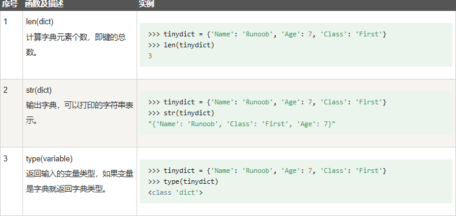
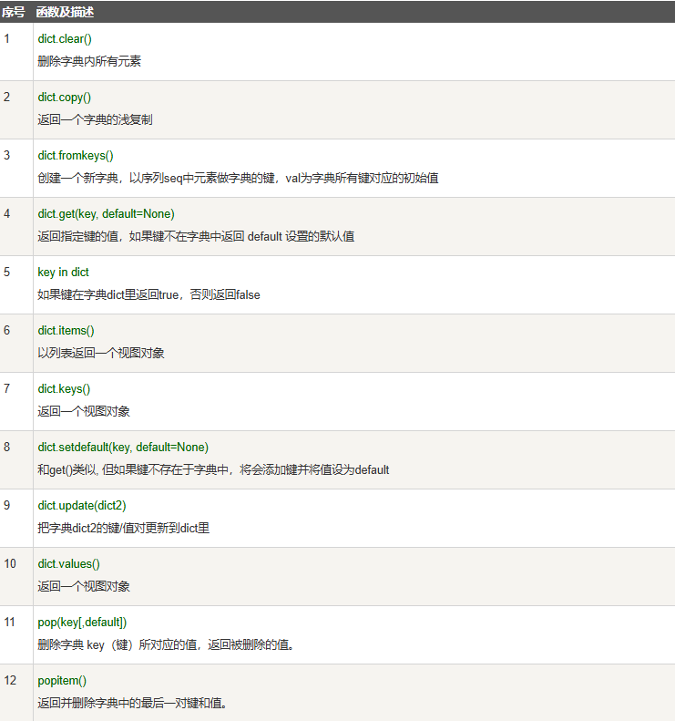

# Python变量之字典

- 字典是另一种**可变**容器模型，且可存储任意类型对象。
- 字典的每个键值 **key=>value** 对用冒号 **:** 分割，每个对之间用逗号(**,**)分割，整个字典包括在花括号 **{}** 中 ,格式如下所示

  ```python
  d = {key1 : value1, key2 : value2, key3 : value3 }
  ```
- **注意：dict 作为 Python 的关键字和内置函数，变量名不建议命名为 **dict。
- 键必须是唯一的，但值则不必。

  值可以取任何数据类型，但键必须是不可变的，如字符串，数字。

  
- 创建空字典

  ```
  # 使用大括号 {} 来创建空字典
  emptyDict = {}

  # 打印字典
  print(emptyDict)

  # 查看字典的数量
  print("Length:", len(emptyDict))

  # 查看类型
  print(type(emptyDict))
  ```

  运行结果

  ```
  {}
  Length: 0
  <class 'dict'>
  ```
- 使用内建函数 **dict()** 创建字典：

  ```python
  emptyDict = dict()

  # 打印字典
  print(emptyDict)

  # 查看字典的数量
  print("Length:",len(emptyDict))

  # 查看类型
  print(type(emptyDict))
  ```

  运行结果

  ```
  {}
  Length: 0
  <class 'dict'>
  ```

## 访问字典里的值

把相应的键放入到方括号中，如下实例:

```python
#!/usr/bin/python3
 
tinydict = {'Name': 'Runoob', 'Age': 7, 'Class': 'First'}
 
print ("tinydict['Name']: ", tinydict['Name'])
print ("tinydict['Age']: ", tinydict['Age'])
```

以上实例输出结果：

```
tinydict['Name']:  Runoob
tinydict['Age']:  7
```

如果用字典里没有的键访问数据，会输出错误如下：

```python
#!/usr/bin/python3
 
tinydict = {'Name': 'Runoob', 'Age': 7, 'Class': 'First'}
 
print ("tinydict['Alice']: ", tinydict['Alice'])
```

以上实例输出结果：

```
Traceback (most recent call last):
  File "test.py", line 5, in <module>
    print ("tinydict['Alice']: ", tinydict['Alice'])
KeyError: 'Alice'
```

## 修改字典

向字典添加新内容的方法是增加新的键/值对，修改或删除已有键/值对如下实例:

```python
#!/usr/bin/python3
 
tinydict = {'Name': 'Runoob', 'Age': 7, 'Class': 'First'}
 
tinydict['Age'] = 8               # 更新 Age
tinydict['School'] = "菜鸟教程"  # 添加信息
 
 
print ("tinydict['Age']: ", tinydict['Age'])
print ("tinydict['School']: ", tinydict['School'])
```

以上实例输出结果：

```
tinydict['Age']:  8
tinydict['School']:  菜鸟教程
```

## 删除字典元素

能删单一的元素也能清空字典，清空只需一项操作。

显式删除一个字典用del命令，如下实例：

```python
#!/usr/bin/python3
 
tinydict = {'Name': 'Runoob', 'Age': 7, 'Class': 'First'}
 
del tinydict['Name'] # 删除键 'Name'
tinydict.clear()     # 清空字典
del tinydict         # 删除字典
 
print ("tinydict['Age']: ", tinydict['Age'])
print ("tinydict['School']: ", tinydict['School'])
```

但这会引发一个异常，因为用执行 del 操作后字典不再存在：

```
Traceback (most recent call last):
  File "/runoob-test/test.py", line 9, in <module>
    print ("tinydict['Age']: ", tinydict['Age'])
NameError: name 'tinydict' is not defined
```

**注：**del() 方法后面也会讨论。

## 字典键的特性

字典值可以是任何的 python 对象，既可以是标准的对象，也可以是用户定义的，但键不行。

两个重要的点需要记住：

1. 不允许同一个键出现两次。创建时如果同一个键被赋值两次，后一个值会被记住，如下实例：

   ```python
   #!/usr/bin/python3

   tinydict = {'Name': 'Runoob', 'Age': 7, 'Name': '小菜鸟'}

   print ("tinydict['Name']: ", tinydict['Name'])
   ```

   以上实例输出结果：

   ```
   tinydict['Name']:  小菜鸟
   ```
2. 键必须不可变，所以可以用**数字，字符串或元组**充当，而用列表就不行，如下实例

   ```python
   #!/usr/bin/python3

   tinydict = {['Name']: 'Runoob', 'Age': 7}

   print ("tinydict['Name']: ", tinydict['Name'])
   ```

   以上实例输出结果：

   ```
   Traceback (most recent call last):
     File "test.py", line 3, in <module>
       tinydict = {['Name']: 'Runoob', 'Age': 7}
   TypeError: unhashable type: 'list'
   ```

## 字典内置函数&方法

Python字典包含了以下内置函数：



Python字典包含了以下内置方法：


