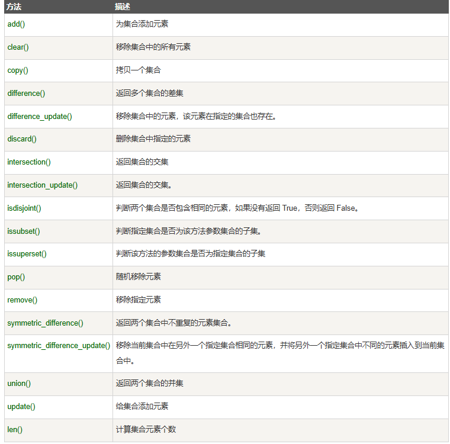

# Python变量之集合

- 集合（set）是一个无序的不重复元素序列。
- 集合中的元素不会重复，并且可以进行交集、并集、差集等常见的集合操作。
- 可以使用大括号 **{ }** 创建集合，元素之间用逗号 **,** 分隔， 或者也可以使用 **set()** 函数创建集合。
- 集合**可变**元素

## 集合创建

1. 集合

   ```python
   set1 = {1, 2, 3, 4}            # 直接使用大括号创建集合
   set2 = set([4, 5, 6, 7])      # 使用 set() 函数从列表创建集合
   ```

   

2. **注意：**创建一个空集合必须用 **set()** 而不是 **{ }**，因为 **{ }** 是用来创建一个空字典。

更多操作

```
>>> basket = {'apple', 'orange', 'apple', 'pear', 'orange', 'banana'}
>>> print(basket)                      # 这里演示的是去重功能
{'orange', 'banana', 'pear', 'apple'}
>>> 'orange' in basket                 # 快速判断元素是否在集合内
True
>>> 'crabgrass' in basket
False

>>> # 下面展示两个集合间的运算.
...
>>> a = set('abracadabra')
>>> b = set('alacazam')
>>> a                                  
{'a', 'r', 'b', 'c', 'd'}
>>> a - b                              # 集合a中包含而集合b中不包含的元素
{'r', 'd', 'b'}
>>> a | b                              # 集合a或b中包含的所有元素
{'a', 'c', 'r', 'd', 'b', 'm', 'z', 'l'}
>>> a & b                              # 集合a和b中都包含了的元素
{'a', 'c'}
>>> a ^ b                              # 不同时包含于a和b的元素
{'r', 'd', 'b', 'm', 'z', 'l'}
```

## 集合的基本操作

### 添加元素

```python
thisset = set(("Google", "Runoob", "Taobao"))
thisset.add("Facebook")
print(thisset)   #{'Taobao', 'Facebook', 'Google', 'Runoob'}

```

还有一个方法，也可以添加元素，且参数可以是列表，元组，字典等，语法格式如下：

```
s.update( x ) #x 可以有多个，用逗号分开。
```

示例：

```
>>> thisset = set(("Google", "Runoob", "Taobao"))
>>> thisset.update({1,3})
>>> print(thisset)
{1, 3, 'Google', 'Taobao', 'Runoob'}
>>> thisset.update([1,4],[5,6])  
>>> print(thisset)
{1, 3, 4, 5, 6, 'Google', 'Taobao', 'Runoob'}
>>>
```

### 移除元素

```
s.remove( x ) #将元素 x 从集合 s 中移除，如果元素不存在，则会发生错误。
```

示例

```
>>> thisset = set(("Google", "Runoob", "Taobao"))
>>> thisset.remove("Taobao")
>>> print(thisset)
{'Google', 'Runoob'}
>>> thisset.remove("Facebook")   # 不存在 会发生错误
Traceback (most recent call last):
  File "<stdin>", line 1, in <module>
KeyError: 'Facebook'
>>>
```

此外还有一个方法也是移除集合中的元素，且如果元素不存在，不会发生错误。格式如下所示：

```
s.discard( x )
```

示例：

```
>>> thisset = set(("Google", "Runoob", "Taobao"))
>>> thisset.discard("Facebook")  # 不存在不会发生错误
>>> print(thisset)
{'Taobao', 'Google', 'Runoob'}
```

我们也可以设置随机删除集合中的一个元素，语法格式如下：

```
s.pop() 
```

示例

```python
thisset = set(("Google", "Runoob", "Taobao", "Facebook"))
x = thisset.pop()

print(x)  # 结果 Runoob  多次执行测试结果都不一样。


```

### 计算集合元素个数

```python
thisset = set(("Google", "Runoob", "Taobao"))
nums=len(thisset)
print(nums)  # 输出结果3
```

### 清空集合

```python
thisset = set(("Google", "Runoob", "Taobao"))
thisset.clear()
print(thisset)  # 输出结果为set()  

```

### 判断元素是否在集合中存在

```
x in s
```


```
>>> thisset = set(("Google", "Runoob", "Taobao"))
>>> "Runoob" in thisset
True
>>> "Facebook" in thisset
False
>>>
```


## 集合内置方法完整列表

