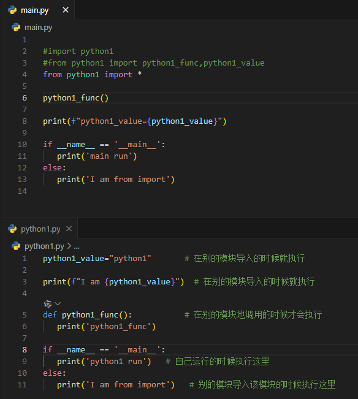

# Python 模块和包

## 模块 module

### 模块导入方式

1. `import 模块名`

   - 解释：将模块整体导入当前模块

   - 引用方式：需要使用模块名字

     ```
     模块名.函数()
     模块名.变量
     ```

   - 示例：

     - python1.py

       ```python
       python1_value="python1"			# 在别的模块导入的时候就执行
       
       print(f"I am {python1_value}")  # 在别的模块导入的时候就执行
       
       def python1_func():				# 在别的模块地调用的时候才会执行
          print('python1_func')
       
       if __name__ == '__main__':
          print('python1 run')   # 自己运行的时候执行这里
       else:
          print('I am from import')   # 别的模块导入该模块的时候执行这里
       ```

     - main.py

       ```python
       
       import python1
       #from python1 import *
       #from python1 import python1_func,python1_value
       
       python1.python1_func()
       
       print(f"python1_value={python1.python1_value}")
       
       if __name__ == '__main__':
          print('main run')   # 自己运行的时候执行这里
       else:
          print('I am from import')   # 别的模块导入该模块的时候执行这里
       
       ```

     - 运行结果

       ```
       I am python1			# main.py 2行 -> python1.py 1行 3行 11行  
       I am from import        # 在import python1 的时候就要执行
       python1_func            # main.py 6行 -> python1.py 6行
       python1_value=python1   # 
       main run
       ```

       

     

2. `froam 模块名 improt 成员/函数`

   - 解释：将模块的指定成员导入到当前模块作用域中

   - 调用方式：不需要模块名

     ```
     已导入的成员
     已导入的函数()
     ```

     

   - 示例

     

3. `from 模块名 import *`

   - 解释：将指定模块的所有成员导入到当前模块作用域中

   - 引用：不要模块名

     ```
     成员
     函数()
     #可以访问模块中所有的成员和模块
     ```

     

   - 示例

     

4. `as 新名字`

   这种方式访问的时候，根据上面规则 用新的名字访问

   - `import 模块名 as module_name`
   - `from 模块名 import 变量/函数 as 新名字`

   

### __name__属性

一个模块被另一个程序第一次引入时，其主程序将运行。如果我们想在模块被引入时，模块中的某一程序块不执行，我们可以用__name__属性来使该程序块仅在该模块自身运行时执行。

```python
#!/usr/bin/python3
# Filename: using_name.py

if __name__ == '__main__':
   print('程序自身在运行')   # 自己运行的时候执行这里
else:
   print('我来自另一模块')   # 别的模块导入该模块的时候执行这里

```

**说明：** 每个模块都有一个`__name__`属性，当其值是`__main__`时，表明该模块自身在运行，否则是被引入。

## 包package

- 定义：包是一种管理 Python 模块命名空间的形式，采用`包.模块名称`
- 比如一个模块的名称是 `A.B`， 那么他表示一个包 A中的子模块 B 。

包的目录组织格式如下：

```
sound/                          顶层包
      __init__.py               初始化 sound 包
      formats/                  文件格式转换子包
              __init__.py
              wavread.py
              wavwrite.py
              aiffread.py
              aiffwrite.py
              auread.py
              auwrite.py
              ...
      effects/                  声音效果子包
              __init__.py
              echo.py
              surround.py
              reverse.py
              ...
      filters/                  filters 子包
              __init__.py
              equalizer.py
              vocoder.py
              karaoke.py
              ...

```

1. 每个包都有一个`__init__.py`，该文件的功能为初始化该包

2. 用户可以每次只导入一个包里面的特定模块，比如：

   ```
   # 导入sound包下effects包下的echo模块
   import sound.effects.echo
   ```

   访问方式：必须使用**全名**去访问

   ```
   sound.effects.echo.echofilter(input, output, delay=0.7, atten=4)
   ```

   

3. `from sound.effects import echo` ：该方式可以**模块名**访问

   ```
   #从包sound.effects里面导入模块echo 
   echo.echofilter(input, output, delay=0.7, atten=4)
   ```

   

4. 直接导入一个函数或者变量：直接调用函数或使用变量

   ```
   from sound.effects.echo import echofilter
   echofilter(input, output, delay=0.7, atten=4)  #访问方式直接调用
   ```

   

5. `from sound.effects import *`

   会导入sound下effects包中的所有子模块

6. 

